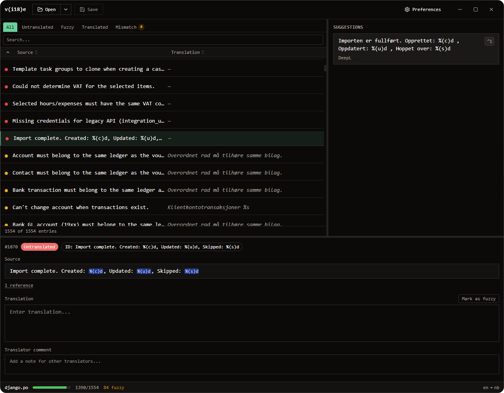

# v(i18)e

A modern translation editor for developers. Built with Electron, React, and TypeScript.


<br clear="left" />



## What it does

v(i18)e lets you open, edit, and save translation files with a clean three-panel interface:

- **Left** — catalog list with filter tabs (All / Untranslated / Translated / Fuzzy), search, and sortable columns
- **Center** — source text + translation editor with placeholder mismatch warnings
- **Right** — translation suggestions from DeepL and your local Translation Memory

Changes are tracked in a local SQLite Translation Memory (TM) and reused as suggestions on future translations.

## Supported formats

| Format         | Extensions    | Notes                                                           |
| -------------- | ------------- | --------------------------------------------------------------- |
| Gettext PO     | `.po`, `.pot` | Full support: fuzzy flag, translator comments, plurals, context |
| Format.js JSON | `.json`       | React-intl translations; requires a reference (source) file     |

## Features

- **DeepL integration** — automatic translation suggestions with smart ICU placeholder handling
- **Translation Memory** — exact and fuzzy matches from your own translation history
- **Placeholder validation** — warns on mismatch between source and translation for ICU, printf, and Python-style placeholders
- **React Compiler** — UI compiled with the React Compiler for automatic memoisation

## Getting started

```bash
bun install
bun run dev
```

DeepL and other settings are available through **Preferences** in the toolbar.

## Build & distribute

```bash
bun run dist:win    # Windows NSIS installer
bun run dist:mac    # macOS DMG
bun run dist:linux  # Linux AppImage
```

Output goes to `release/`.

## Tech stack

- [Electron](https://www.electronjs.org/) + [tsdown](https://github.com/sxzz/tsdown) + [Vite](https://vitejs.dev/)
- [React 19](https://react.dev/) + [TypeScript](https://www.typescriptlang.org/)
- [Tailwind CSS v4](https://tailwindcss.com/) + [shadcn/ui](https://ui.shadcn.com/)
- [Zustand](https://zustand-demo.pmnd.rs/) + [Immer](https://immerjs.github.io/immer/) for state management
- [better-sqlite3](https://github.com/WiseLibs/better-sqlite3) for the local TM database
- [deepl-node](https://github.com/DeepLcom/deepl-node) for the DeepL SDK

## License

MIT
